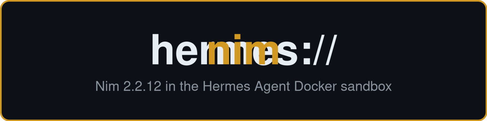
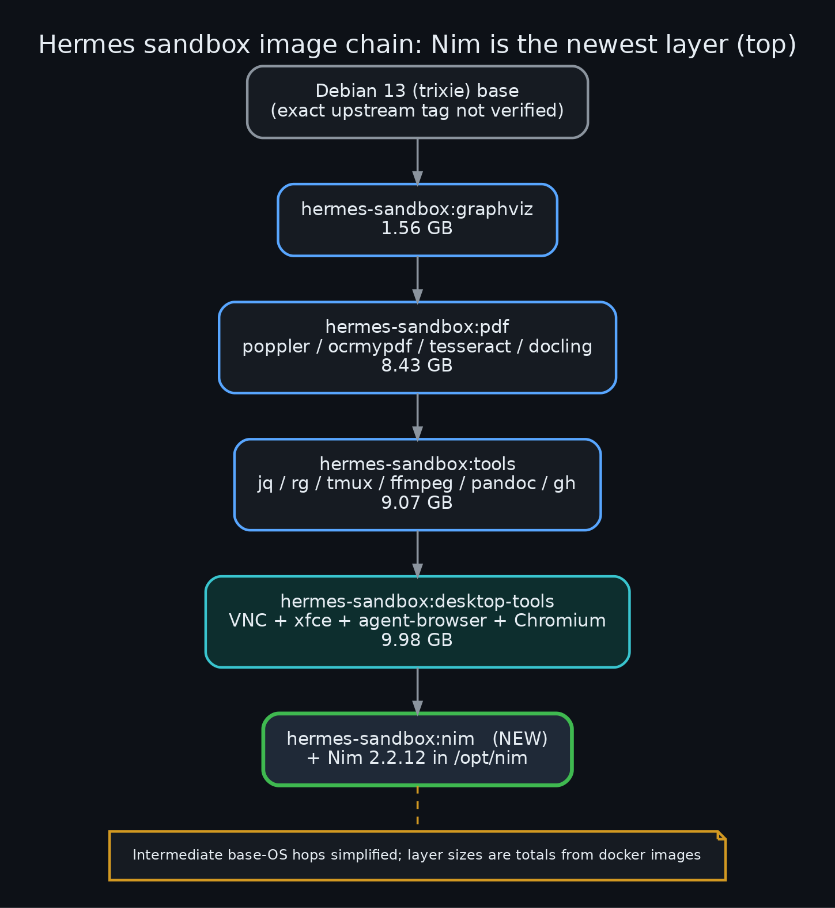
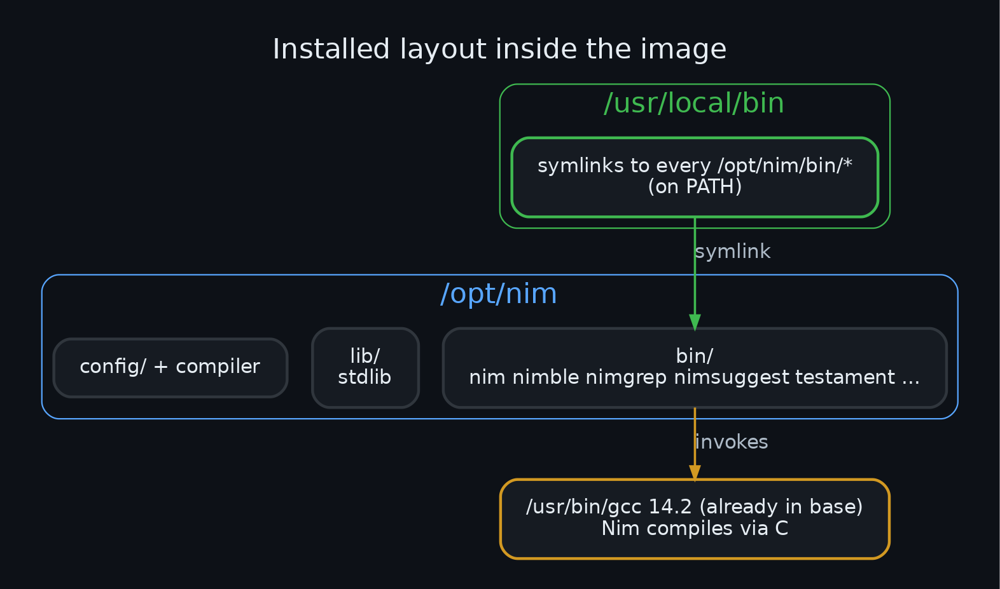
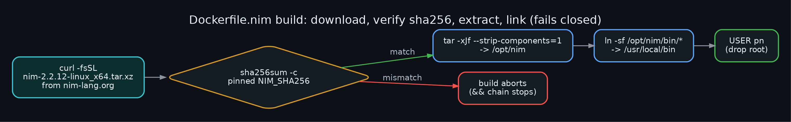
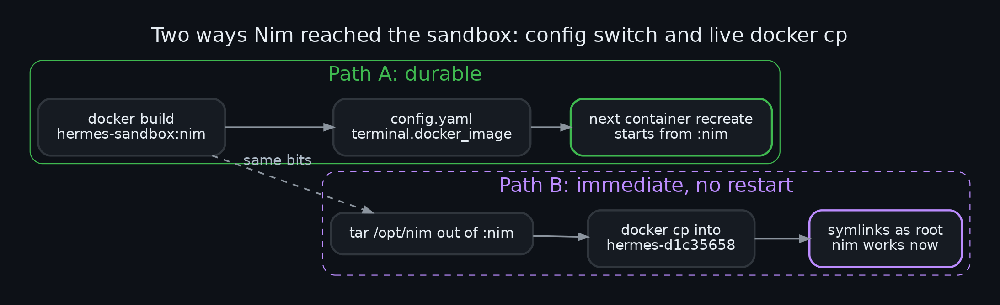
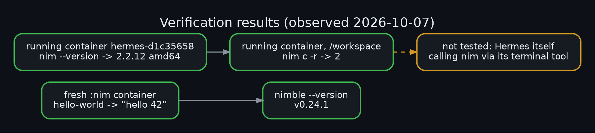
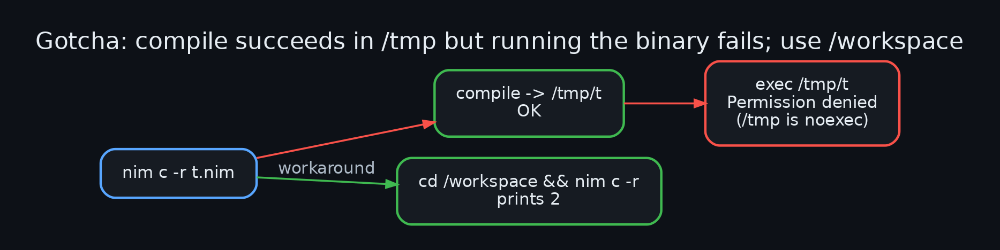
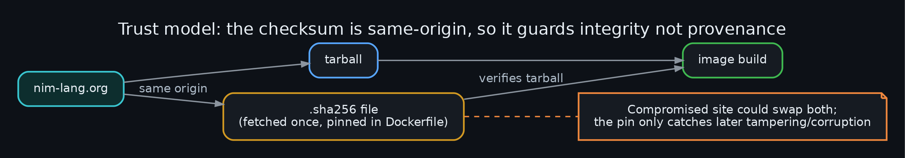

<div align="center">



# Adding the Nim toolchain to a Hermes Agent Docker sandbox


*Hermes runs its shell tool inside a Docker sandbox, so a compiler installed on the host is invisible to it. This repo
records how Nim 2.2.12 was baked into the sandbox image, how it was activated in the already-running container without
losing state, what was verified, and one sharp edge (`/tmp` is noexec).*

</div>

---

## Contents
1. [Why this exists](#why-this-exists)
2. [What was built](#what-was-built)
3. [Dockerfile walkthrough](#dockerfile-walkthrough)
4. [Activation: two paths](#activation-two-paths)
5. [Verification](#verification)
6. [Gotchas](#gotchas)
7. [Trust model](#trust-model)
8. [Rebuild and reproduce](#rebuild-and-reproduce)
9. [What was not verified](#what-was-not-verified)
10. [Diagram gallery](#diagram-gallery)

## Why this exists
Hermes Agent is configured with `terminal.backend: docker`. Every shell command the agent runs executes in a container
created from `terminal.docker_image`. Installing Nim on the host therefore does nothing for the agent; the toolchain has
to exist in that image. The sandbox is already a stack of purpose-built images, so Nim was added as one more layer.

## What was built
A new image, `hermes-sandbox:nim`, one layer on top of `hermes-sandbox:desktop-tools`. The base already ships gcc 14.2,
which Nim needs because it compiles through C, so no extra compiler packages were added.



Resulting install layout: the full official distribution lives in `/opt/nim`, and every binary in `/opt/nim/bin` is
symlinked into `/usr/local/bin` so it is on `PATH` for the non-root `pn` user.



## Dockerfile walkthrough
See [`Dockerfile.nim`](Dockerfile.nim).

| Step | Purpose |
|---|---|
| `FROM hermes-sandbox:desktop-tools` | inherit the whole existing sandbox (tools, PDF stack, browser desktop, gcc) |
| `USER root` | needed to write `/opt` and `/usr/local/bin` |
| `ARG NIM_VERSION`, `ARG NIM_SHA256` | pin version and checksum in one place; bump both together |
| `curl -fsSL` | `-f` fails on HTTP errors instead of saving an error page |
| `sha256sum -c` | build aborts if the tarball differs from the pin |
| `tar -xJf --strip-components=1` | unpack straight into `/opt/nim` |
| symlink loop | expose `nim`, `nimble`, `nimgrep`, `nimsuggest`, `testament`, etc. |
| `USER pn` | return to the unprivileged sandbox user |

The steps are chained with `&&` in a single `RUN`, so a failed checksum stops the build and leaves no half-installed layer.



## Activation: two paths
**Path A (durable):** build the image and set `terminal.docker_image: hermes-sandbox:nim` in `~/.hermes/config.yaml`. Hermes
uses the new image the next time it creates its container.

**Path B (immediate):** Hermes keeps a persistent container (`container_persistent: true`), and recreating it would discard
state outside the `/workspace` mount. So the same `/opt/nim` tree was streamed out of the new image with `tar` and into the
live container with `docker cp`, then the symlinks were created as root with `docker exec -u root`.

```sh
docker run --rm hermes-sandbox:nim tar -C /opt -cf - nim | docker cp - <container>:/opt/
docker exec -u root <container> sh -c 'for b in /opt/nim/bin/*; do ln -sf "$b" /usr/local/bin/$(basename "$b"); done'
```



## Verification
Observed on 2026-10-07:

| Check | Result |
|---|---|
| fresh `hermes-sandbox:nim` container: compile and run a one-line program | printed `hello 42` |
| `nimble --version` | `v0.24.1` |
| live container: `nim --version` | `Nim Compiler Version 2.2.12 [Linux: amd64]` |
| live container: compile and run in `/workspace` | printed `2` |



## Gotchas
**`/tmp` is noexec in the sandbox.** Compiling a program in `/tmp` succeeds, but `nim c -r` then fails with
`Permission denied` when it tries to execute the result. Build and run under `/workspace` (or any exec-enabled mount).
This is a property of the sandbox, not of Nim.



## Trust model
The tarball and its `.sha256` file both come from nim-lang.org. Pinning the checksum in the Dockerfile protects against
corruption and against the file changing *after* it was first pinned, but it does not prove the original download was
genuine, because an attacker controlling the site could have changed both. For stronger provenance, verify against an
independently obtained checksum or signature before bumping the pin.



## Rebuild and reproduce
```sh
docker build -t hermes-sandbox:nim -f Dockerfile.nim .
docker run --rm hermes-sandbox:nim nim --version
./render.sh   # re-render diagrams (needs graphviz) and the logo
```
Requires the `hermes-sandbox:desktop-tools` base image, which is built from the author's private sandbox Dockerfiles and is
not included here. To adapt, change the `FROM` line to any Debian/Ubuntu image that has `gcc`, `curl` and `xz-utils`.
To upgrade Nim, change both `NIM_VERSION` and `NIM_SHA256` (fetch the new `.sha256` from nim-lang.org).

## What was not verified
- Hermes itself invoking `nim` through its terminal tool; checks were run with `docker run` / `docker exec`.
- The exact upstream tag of the very first image layer (only the OS, Debian 13, was confirmed).
- Layer sizes in diagram 1 are whole-image totals from `docker images`, not per-layer deltas.

## Diagram gallery
Each diagram ships as `.dot` source, `.png` and `.svg` in [`diagrams/`](diagrams/). Prefer the SVGs for editing or slides.

| # | Diagram |
|---|---|
| 01 | [Image layer chain](diagrams/01_image_layer_chain.svg) |
| 02 | [Build pipeline](diagrams/02_build_pipeline.svg) |
| 03 | [Install layout](diagrams/03_install_layout.svg) |
| 04 | [Activation paths](diagrams/04_activation_paths.svg) |
| 05 | [/tmp noexec gotcha](diagrams/05_tmp_noexec_gotcha.svg) |
| 06 | [Verification results](diagrams/06_verification.svg) |
| 07 | [Trust model](diagrams/07_trust_model.svg) |
